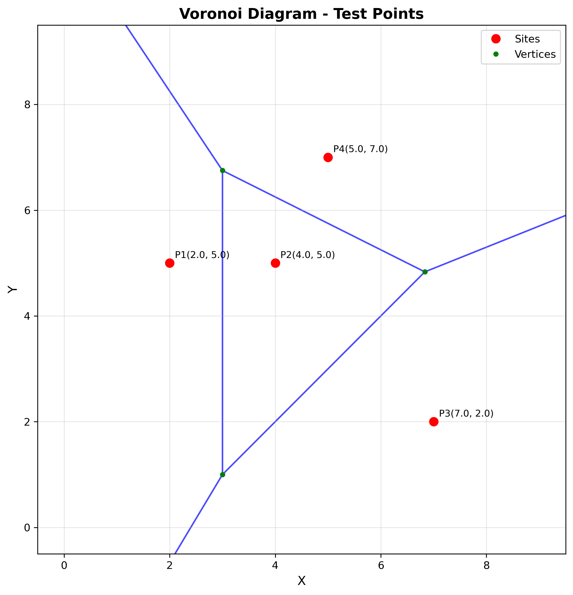
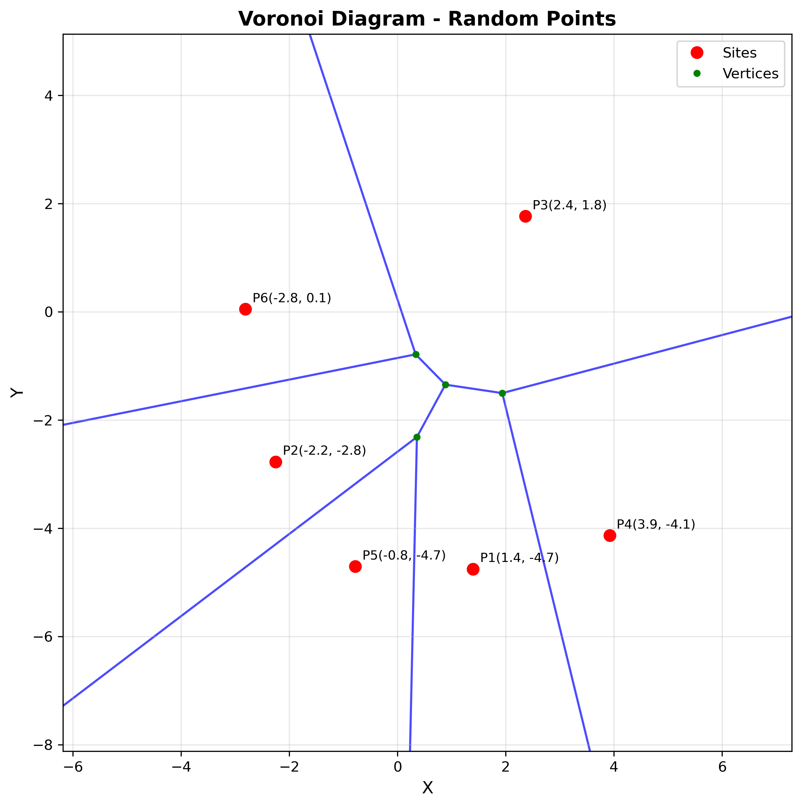

# Voronoi Diagram Implementation

This repository contains a Python implementation of a Voronoi diagram generator. The Voronoi diagram is a partitioning of a plane into regions based on distance to a specified set of points. For each site point, its corresponding region consists of all points closer to that site than to any other.

## Table of Contents

- [Introduction](#introduction)
- [Algorithm](#algorithm)
- [Implementation Details](#implementation-details)
- [Visualization](#visualization)
- [Code Structure](#code-structure)
- [Examples](#examples)
- [Usage](#usage)

## Introduction

A Voronoi diagram is a mathematical construct that divides a space into regions based on the proximity to a set of predefined points. In a 2D Voronoi diagram, each region corresponds to one of the initial points, and all points within that region are closer to that initial point than to any other.

This implementation provides a robust solution for calculating and visualizing Voronoi diagrams for a given set of 2D points.

## Algorithm

This implementation uses a geometric approach to construct the Voronoi diagram:

1. **Finding Voronoi Vertices**: 
   - For all combinations of three site points, calculate the circumcenter (which becomes a Voronoi vertex)
   - Validate the vertex using the empty circle test (no other site point inside the circumcircle)

2. **Creating Voronoi Edges**:
   - For each pair of sites, find vertices that lie on their perpendicular bisector
   - Create edges connecting these vertices
   - Handle special cases like semi-infinite and fully infinite edges

3. **Edge Clipping**:
   - Clip edges to the specified bounding box to create a finite diagram

## Implementation Details

### Data Structures

- **Point**: Represents a 2D point with x and y coordinates.
- **Edge**: Represents an edge in the Voronoi diagram with start/end points and the two sites it separates.
- **VoronoiDiagram**: The main class that contains sites, edges, and vertices of the diagram.

### Key Methods

- **_circumcenter**: Calculates the circumcenter of three points, which becomes a potential Voronoi vertex.
- **_find_voronoi_vertices**: Identifies all valid Voronoi vertices using the empty circle test.
- **_create_edges**: Constructs edges between appropriate Voronoi vertices.
- **_extend_ray_to_boundary**: Extends semi-infinite edges to the bounding box.
- **_clip_edges**: Ensures all edges fit within the specified bounds.

## Visualization

The implementation includes functionality to visualize the Voronoi diagram using matplotlib:


*Voronoi Diagram with 4 predefined points*


*Voronoi Diagram with 6 random points*

## Code Structure

- **Point Class**: Represents 2D points with distance calculations and equality testing.
- **Edge Class**: Represents edges with start/end points and the two sites they separate.
- **VoronoiDiagram Class**: The main class that constructs and stores the complete diagram.
- **Visualization Functions**: For displaying and saving diagram images.
- **Test Functions**: Demonstrate the implementation with sample and random points.

## Examples

### Example 1: Predefined Points
The implementation is tested with a set of four predefined points:
- P1(2, 5)
- P2(4, 5)
- P3(7, 2)
- P4(5, 7)

This results in:
- 4 sites
- 3 Voronoi vertices
- 6 Voronoi edges

### Example 2: Random Points
The implementation also demonstrates generating a Voronoi diagram for a set of randomly generated points.

## Usage

To use this implementation, follow these steps:

1. Import the necessary classes:
```python
from voronoi import Point, VoronoiDiagram, display_voronoi_diagram
```

2. Define your site points:
```python
sites = [
    Point(2, 5),
    Point(4, 5),
    Point(7, 2),
    Point(5, 7)
]
```

3. Create a Voronoi diagram:
```python
voronoi = VoronoiDiagram(sites)
```

4. Optionally, visualize the diagram:
```python
display_voronoi_diagram(voronoi, title="My Voronoi Diagram", filename="output.png")
```

5. Access the diagram's components:
```python
print(f"Number of vertices: {len(voronoi.vertices)}")
print(f"Number of edges: {len(voronoi.edges)}")
```

## Technical Details

- The implementation uses a geometric approach rather than a sweep-line algorithm.
- Edge cases like collinear points and numerical precision issues are handled.
- The diagram is properly clipped to the specified bounding box.
- The output includes both the geometric structure (vertices and edges) and visualization.
